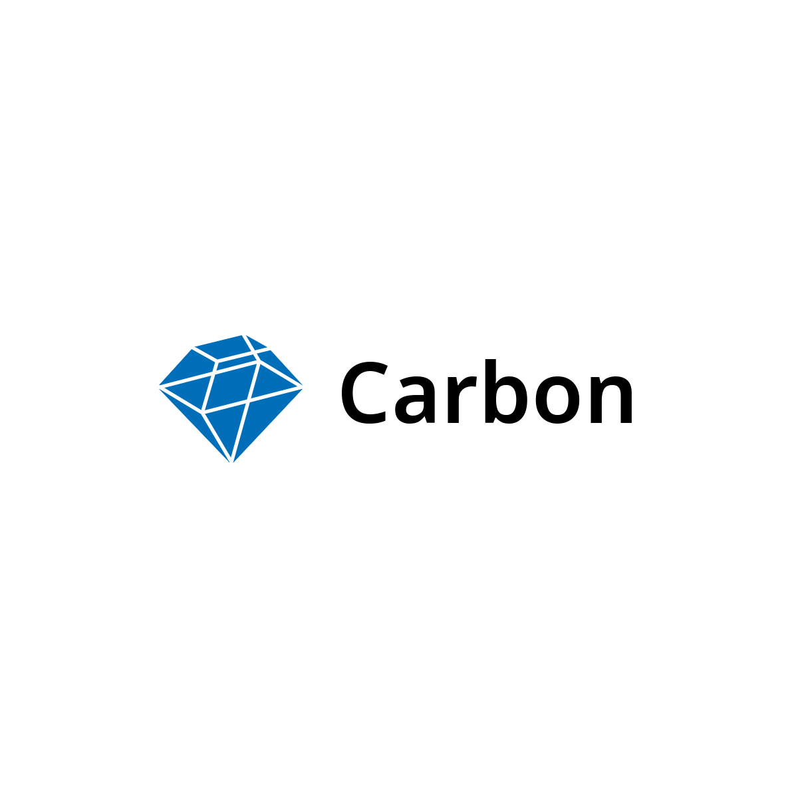

    
    
    
    
    
    
    
    

    Carbon is an 📖 open-source, 🪙 free messaging server.

## Our Mission

We aim to provide **🔒 secure, end-to-end encrypted**, **🎯 robust** messaging for everyone.

## How it Works

Carbon Clients connect to an instance of a Carbon Server. The client (probably) uses the [Carbon.js](https://github.com/carbon-chat/carbon.js) library to communicate with the server to send and receive messages, voice and video calls, and more.

## Contributors

## License

Carbon Project © 2024, contributors to the Carbon Project - Released under the [MIT License](LICENSE.md).
